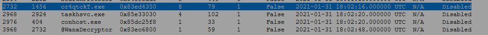
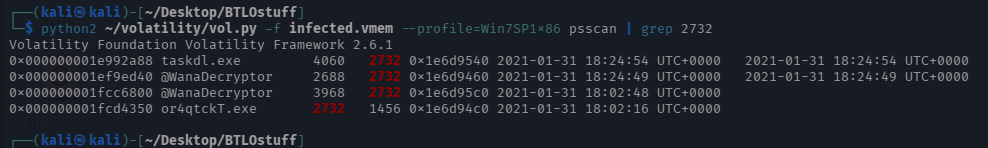
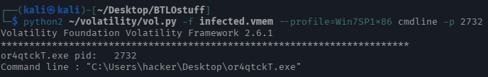

# WannaCry Memory Forensics

**Platform:** Blue Team Labs Online
**Category:** Security Operations / Memory Forensics
**Difficulty:** Easy
**Date Completed:** 2021-01-31

---

## Scenario

> The Account Executive called the SOC earlier and sounds very frustrated and angry. He stated he can’t access any files on his computer and keeps receiving a pop-up stating that his files have been encrypted. You disconnected the computer from the network and extracted the memory dump of his machine and started analyzing it with Volatility. Continue your investigation to uncover how the ransomware works and how to stop it!

## Objective

Analyze a memory dump from an infected host to identify the ransomware process, its execution chain, the file used for encryption, and determine the ransomware family.

## Tools Used

- Volatility 2 (Volatility Foundation 2.6.1)
- Kali Linux

---

## Analysis

### Initial Triage

The `infected.vmem` dump could not be read by default. I first pulled the Volatility symbols for Windows from the official Volatility repository, but that would not work on FLARE-VM or Kali after ~3 hours of troubleshooting. The GUI version worked but offered no control over the commands I could run, so I installed Volatility 2, which ran properly. All analysis below uses the `Win7SP1x86` profile.

### Process Scan

Ran `vol.py -f infected.vmem --profile=Win7SP1x86 psscan` to list processes. Two items stood out: a random-string executable `or4qtckT.exe` (PID 2732) and `@WanaDecryptor` (PID 3968), whose PPID is 2732 — making it a child of `or4qtckT.exe`. `taskdl.exe` also appears as a child process.

### Drilling into PID 2732

Ran `vol.py -f infected.vmem --profile=Win7SP1x86 psscan | grep 2732`. This surfaced the file-deletion process `taskdl.exe` spawned under the suspicious process.

### Execution Path

Ran `vol.py -f infected.vmem --profile=Win7SP1x86 cmdline -p 2732` to recover the command line, revealing the file was executed from `C:\Users\hacker\Desktop\or4qtckT.exe`.

### Encryption Key

Ran `vol.py -f infected.vmem --profile=Win7SP1x86 filescan | grep -i .eky` to locate the public key file used to encrypt the private key: `00000000.eky`.

---

## Question Walkthrough

**Q1: Run “vol.py -f infected.vmem --profile=Win7SP1x86 psscan” that will list all processes. What is the name of the suspicious process?**
**Answer:** `or4qtckT.exe`
Random-string executable surfaced in the `psscan` output (PID 2732).

**Q2: What is the parent process ID for the suspicious process?**
**Answer:** `2732`
`@WanaDecryptor` (PID 3968) shows a PPID of 2732, tying it back to `or4qtckT.exe`.

**Q3: What is the initial malicious executable that created this process?**
**Answer:** `or4qtckT.exe`
It is the parent (PID 2732) that spawned `@WanaDecryptor`.

**Q4: If you drill down on the suspicious PID (psscan | grep 2732), find the process used to delete files.**
**Answer:** `taskdl.exe`
Found via `psscan | grep 2732` as a child of PID 2732.

**Q5: Find the path where the malicious file was first executed.**
**Answer:** `C:\Users\hacker\Desktop\or4qtckT.exe`
Recovered with `cmdline -p 2732`.

**Q6: Can you identify what ransomware it is? (Do your research!)**
**Answer:** `WannaCry`
The `@WanaDecryptor` process name identifies the family; confirmed via research.

**Q7: What is the filename for the file with the ransomware public key that was used to encrypt the private key? (.eky extension)**
**Answer:** `00000000.eky`
Found with `filescan | grep -i .eky`.

---

## IOCs

| Type | Value |
|------|-------|
| File / Path | C:\Users\hacker\Desktop\or4qtckT.exe |
| Process | or4qtckT.exe (PID 2732) |
| Process | @WanaDecryptor (PID 3968) |
| Process | taskdl.exe |
| File | 00000000.eky |

## Analyst Notes

WannaCry infection. The dropper `or4qtckT.exe` executes from the user's Desktop and spawns `@WanaDecryptor` (ransom note / decryptor UI) and `taskdl.exe` (deletes shadow/temporary files to hinder recovery). The `.eky` file holds the RSA public key used to encrypt the per-file/private key material.

MITRE ATT&CK: T1486 (Data Encrypted for Impact), T1490 (Inhibit System Recovery), T1059 (Command and Scripting Interpreter).

Defenders should alert on: execution of randomly-named binaries from user Desktop/profile paths, creation of `@WanaDecryptor`/`taskdl.exe`, `.eky`/`.wnry`/`.wncry` file artifacts, and mass file-write/rename activity.

## Key Takeaways

- Practiced memory forensics with Volatility (`psscan`, `cmdline`, `filescan`) to reconstruct a ransomware execution chain from a raw dump.
- Reinforced parent/child process tracing to distinguish the initial dropper from its spawned components.
